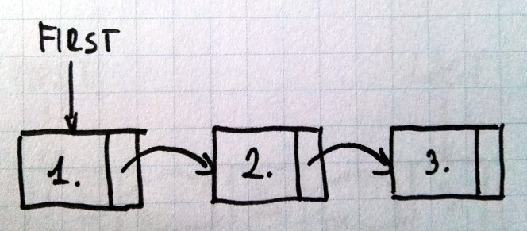

# Terminal-Snake 🐍

C snake game realized on list

## What is list?

List is a data structure where each node is connected to 'next' one, from the first to the last.


 
## How to use it

Compile:

```bash
	make clean && make && ./terminal-snake
```
Run:

```bash
	./terminal-snake
```

## TO-DO

1. list data structure~
2. moving function of fixed struct
3. walls
4. collision with walls
5. adding nodes after eating apples

## What's to work on?

* apple is regenerating before beeing eaten
* snake is not moving by itself
* snake can move through it's own body
* terminal is not 'refreshing' whole game history is seen after game ends
